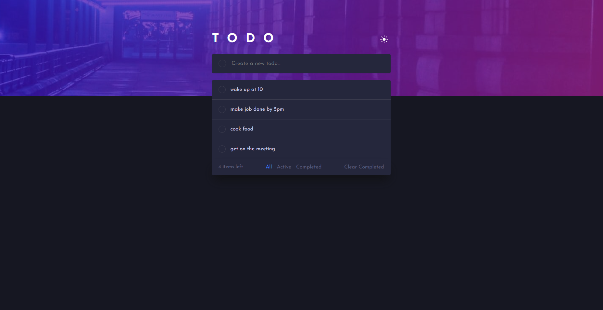

# 📝 Full-Stack ToDo Application

**🔗 [Live Demo](https://todoappfull.netlify.app)**



A modern Full-Stack ToDo application built with **Angular** and **ASP.NET Core Web API**. The application provides a responsive user interface, persistent data storage with PostgreSQL, and a RESTful API powered by Entity Framework Core — fully deployed with a live backend, database, and frontend.

---

## 🎯 Challenge

This project is based on the [Todo App challenge on Frontend Mentor](PASTE_YOUR_CHALLENGE_URL_HERE), extended into a full-stack application with a custom ASP.NET Core backend instead of local storage.

**Implemented from the challenge:**
- ✅ View the optimal layout for mobile and desktop
- ✅ Add, edit, delete, and toggle todos as complete
- ✅ Filter by all / active / complete
- ✅ Clear all completed todos
- ✅ Drag and drop to reorder items
- ✅ Light / dark theme toggle

**Extended beyond the base challenge:**
- Persistent backend storage (PostgreSQL + ASP.NET Core API, not local storage)
- Per-device data separation via a custom DeviceId system
- Full cloud deployment (Render for backend/database, Netlify for frontend)

---

## 🚀 Features

- ✅ Create, update, and delete tasks
- ✅ Mark tasks as completed or active
- ✅ Filter tasks (All, Active, Completed)
- ✅ Server-side filtering using LINQ queries
- ✅ Drag & Drop task reordering (Angular CDK)
- ✅ Dark / Light theme
- ✅ Responsive design
- ✅ PostgreSQL database persistence
- ✅ RESTful API architecture
- ✅ Per-device data separation (no login required)

---

## 🛠️ Tech Stack

### Frontend
- Angular
- TypeScript
- SCSS
- Angular CDK
- RxJS

### Backend
- ASP.NET Core Web API
- C#
- Entity Framework Core

### Database
- PostgreSQL (hosted on Render)

### Hosting
- Backend + Database: Render
- Frontend: Netlify

---

## 📁 Project Structure

```
TodoApp
│
├── Frontend/       # Angular application
├── Backend/        # ASP.NET Core Web API
└── README.md
```

---

---

# 🔧 Getting Started

## Prerequisites

Install the following before running the project:

- .NET SDK 8.0 (or your project version)
- Node.js (LTS)
- Angular CLI

```bash
npm install -g @angular/cli
```

- PostgreSQL (local install, or a free instance on Render/Supabase/ElephantSQL)
- Visual Studio 2022 or VS Code

---

## 1️⃣ Clone the repository

```bash
git clone https://github.com/akaneDM/YOUR-REPOSITORY.git

cd YOUR-REPOSITORY
```

---

## 2️⃣ Backend Setup

Navigate to the backend folder.

```bash
cd Backend/WebApplication2
```

### Configure the database

Create an `appsettings.Development.json` file (not committed to source control) with your own PostgreSQL connection details:

```json
{
  "ConnectionStrings": {
    "DefaultConnection": "Host=your-host;Port=5432;Database=your-db;Username=your-user;Password=your-password;SSL Mode=Require;Trust Server Certificate=true"
  }
}
```

---

### Create the database

Run:

```bash
dotnet ef database update
```

This applies the included Entity Framework Core migrations and creates all required tables in your PostgreSQL database.

---

### Start the backend

```bash
dotnet run
```

The API will usually be available at

```
https://localhost:xxxx
```

Swagger documentation:

```
https://localhost:xxxx/swagger
```

---

## 3️⃣ Frontend Setup

Navigate to the frontend folder.

```bash
cd Frontend/angProj
```

Install dependencies.

```bash
npm install
```

Update the API base URL in `src/app/Services/api.service.ts` to point to your local backend (`https://localhost:xxxx/api/Values`) if testing locally.

Run Angular.

```bash
ng serve
```

The application will be available at

```
http://localhost:4200
```

---

---

## 📦 Database

The project uses **Entity Framework Core** with **PostgreSQL**.

The required migrations are already included.

Simply run:

```bash
dotnet ef database update
```

No manual SQL scripts are required.

---

## 📚 What I Learned

This project pushed me well beyond the original frontend challenge into full-stack territory, and most of the real learning came from debugging deployment issues, not just writing feature code.

**Backend & Database**
- Built a REST API in ASP.NET Core with full CRUD endpoints, using LINQ for server-side filtering (active/completed) instead of filtering in the frontend.
- Migrated an existing SQL Server + EF Core project to PostgreSQL mid-project, which meant swapping the EF Core provider to `Npgsql`, rewriting the connection string format, and regenerating migrations from scratch.
- Learned the practical difference between "internal" and "external" database connection strings when a backend and database are hosted separately on Render, and why local development needs the external one while the deployed app needs the internal one.

**Deployment**
- Deployed a .NET backend to Render using a custom Dockerfile, since Render has no native .NET runtime.
- Debugged a chain of real production issues: malformed connection strings, CORS rejecting my frontend's origin, and a header-name typo that silently broke device-based data filtering in production while working fine locally.
- Configured CORS explicitly to allow only my deployed frontend's origin, rather than leaving it open to everything.

**Feature: Per-Device Data Separation**
- Since the app has no login system, I implemented a `DeviceId` pattern: each browser generates and persists a unique ID in `localStorage`, sent via a custom request header, and the backend filters all queries by it. This keeps each device's list private without needing full user accounts — a pattern that could later be swapped for real `UserId`-based auth.

**Accessibility**
- Learned that `*ngIf`-based element swapping breaks CSS transitions, since Angular removes and recreates the DOM node instead of toggling a class — fixed by keeping both elements mounted and animating via CSS custom properties instead.
- Converted clickable `div`s to real `button` elements for keyboard accessibility, and learned buttons need explicit style resets (`appearance: none`, `border: none`, etc.) plus `type="button"` to avoid unintended form-submission side effects.

## 🔭 Continued Development

- Replace `DeviceId`-based separation with real user accounts (login/auth) so the same list can sync across a person's own devices.
- Add keyboard-based reordering as an alternative to drag-and-drop for full accessibility compliance.
- Add automated tests for the API endpoints.

---

## 👨‍💻 Author

**akane**

GitHub: https://github.com/akaneDM